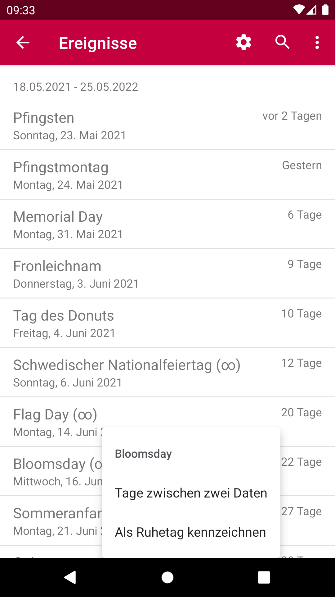

<table style="width: 100%; border: none">
<tr>
<td valign="top" style="width: 35%; border: none">

</td>
<td valign="top" style="border: none">

TKWeek has many national and international public holidays built in, for example:

<ul>
<li>Reformation Day</li>
<li>St. Martin's Day</li>
<li>Christmas</li>
<li>Good Friday</li>
<li>Seven Sleepers Day</li>
<li>Pentecost</li>
<li>Ash Wednesday</li>
<li>Easter</li>
</ul>

Some of the other special days TKWeek knows:

<ul>
<li>Ice Saints</li>
<li>Valentine's Day</li>
<li>Mother's Day</li>
<li>Halloween</li>
<li>St. Patrick’s Day</li>
<li>Earth Day</li>
<li>All Saints</li>
</ul>

And there are so many more included.

</td>
</tr>
</table>
