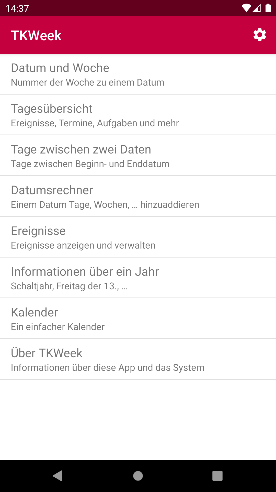

<table style="width: 100%; border: none">
<tr>
<td valign="top" style="width: 35%; border: none">

</td>
<td valign="top" style="border: none">

Do you need to convert between a <strong>week number</strong> and a date or require some information about a date? Find out if a year is a leap year, calculate the number of days, business days, weeks, weekends, month turns and years between two dates? Want to add or subtract days, weeks or months to a given date?

With TKWeek, it‘s no hassle. Even a basic calendar view is at your fingertips. You can use it to flag days off. Just tap and hold until the color changes. And with <strong>My Day</strong> you see what is up on a particular day.

Curious to know when Friday 13th takes place? TKWeek will tell you. It also offers a bunch of widgets: <strong>Week info</strong> shows you the current week number, the total number of weeks in a year, the first and last day of a week and the current date. <strong>Events list</strong> even shows up to four upcoming events. <strong>Current Date</strong> is a simple widget that displays the current day of the week, date and month. Finally <strong>Day of year</strong> shows the current day of the year (julian date) and the total number of days in a year.

</td>
</tr>
</table>

 
Google Play and the Google Play logo are trademarks of Google LLC.

 Want to contribute? You can find the source code at <a href="https://github.com/MATHEMA-GmbH/TKWeek">https://github.com/MATHEMA-GmbH/TKWeek</a>

