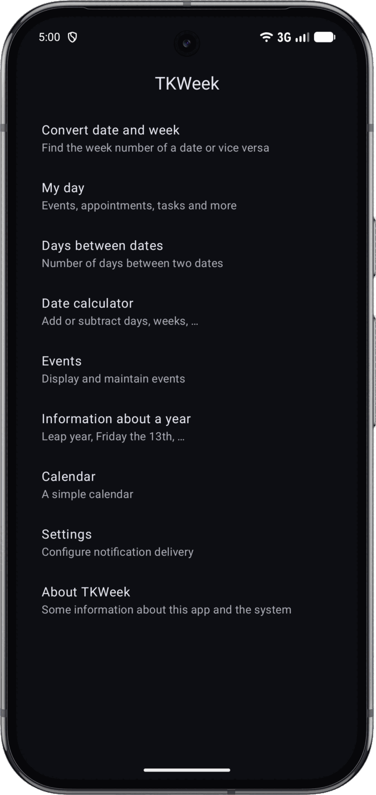

  
  

    
Do you need to convert between a <strong>week number</strong> and a date or require some information about a date? Find out if a year is a <strong>leap year</strong>, calculate the number of days, business days, weeks, weekends, month turns and years <strong>between two dates</strong>? Want to add or subtract days, weeks or months to a given date?

    
With <strong>TKWeek</strong>, it‘s no hassle. Even a basic calendar view is at your fingertips. You can use it to flag days off. Just tap and hold until the color changes. And with <strong>My Day</strong> you see what is up on a particular day.

    
Curious to know when Friday 13th takes place? <strong>TKWeek</strong> will tell you. The app has many national and international public holidays built in, for example Reformation Day, St. Martin&apos;s Day, Christmas, Good Friday, Seven Sleepers Day, Pentecost, Ash Wednesday, and Easter.

    
Some of the other special days TKWeek knows: Ice Saints, Valentine&apos;s Day, Mother&apos;s Day, Halloween, St. Patrick&apos;s Day, Earth Day, All Saints. And there are so many more included.

    
Also important:

    <ul>
    <li>No in-app purchases</li>
    <li>No ads</li>
    <li>No need to unlock anything</li>
    <li>We respect your privacy</li>
    <li>Completely <a href="https://github.com/tkuenneth/TKWeek">open source</a></li>
    </ul>
    

    
    
    

  

